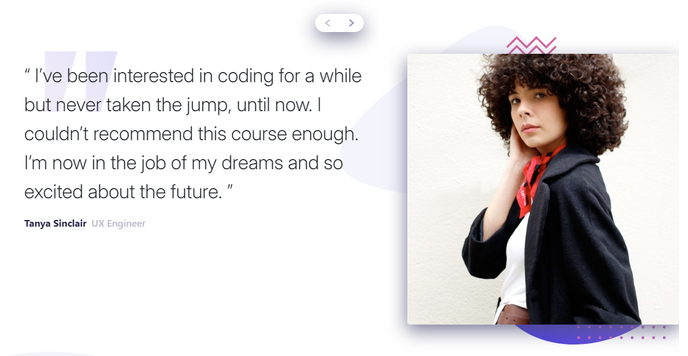

# Frontend Mentor - Coding bootcamp testimonials slider solution

This is a solution to the [Coding bootcamp testimonials slider challenge on Frontend Mentor](https://www.frontendmentor.io/challenges/coding-bootcamp-testimonials-slider-4FNyLA8JL). Frontend Mentor challenges help you improve your coding skills by building realistic projects. 

## Table of contents

- [Overview](#overview)
  - [The challenge](#the-challenge)
  - [Screenshot](#screenshot)
  - [Links](#links)
- [My process](#my-process)
  - [Built with](#built-with)
  - [What I learned](#what-i-learned)
  - [Continued development](#continued-development)
  - [Useful resources](#useful-resources)
- [Author](#author)

## Overview

### The challenge

Users should be able to:

- View the optimal layout for the component depending on their device's screen size
- Navigate the slider using either their mouse/trackpad or keyboard

### Screenshot

### Links

- Solution URL: [Solution](https://www.frontendmentor.io/solutions/coding-bootcamp-testimonials-slider-bootstrap-5-hr8dskDVeP)
- Live Site URL: [Live-site](https://drmetr.github.io/Coding-bootcamp-testimonials-slider-challenge/)

## My process

I made it using Bootstrap and regular html/css where bootstrap failed me. I also included myself (deanon!) as a third carousel item because two items felt too little and because I thought it was funny.

### Built with

- Semantic HTML5 markup
- CSS custom properties
- Flexbox
- Mobile-first workflow
- Bootstrap-5

### What I learned

 I learned how to implement frameworks in my projects, particularly working with Bootstrap 5. Since carousels are already present as bootstrap component there was no need for JS. I also adopted a way similar to frameworks' line of thinking: writing lots of classes and adding them to html elements that bear the features instead of describing each element on its own. This is convenient, makes code reusable. Adding the carousel was an issue because I didn't figure how to position buttons over item photos.

 UPD: I managed to make a responsive carousel button attached to a carouselitem picture by using the experimental anchor and target attributes. Think, they're underestimated.

### Continued development

More working with frameworks like Tailwind or Bulma. Taking more challenging challenges.

### Useful resources

- [6 Ways to Stretch a Background Image with CSS](https://cloudinary.com/guides/front-end-development/6-ways-to-stretch-a-background-image-with-css) - learned about background-attachment property

- [CSS Anchor Positioning Guide](https://css-tricks.com/css-anchor-positioning-guide/) - helped me with the buttons a little

- [MDN position-area property](https://developer.mozilla.org/en-US/docs/Web/CSS/position-area) - helped me understanding achor-target positioning

## Author

- Website - [DrMetr](https://github.com/DrMetr)
- Frontend Mentor - [@yourusername](https://www.frontendmentor.io/profile/yourusername)
